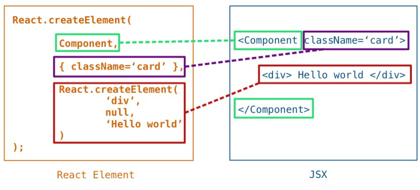
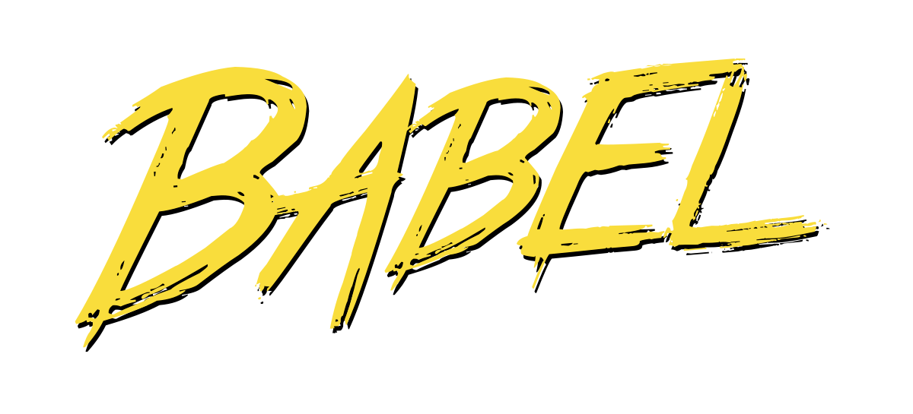
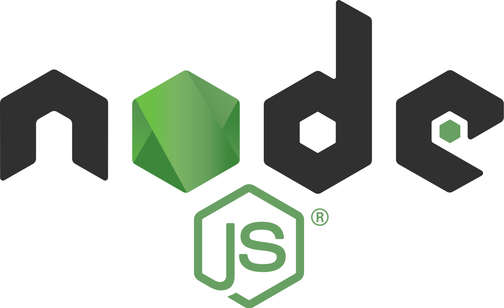
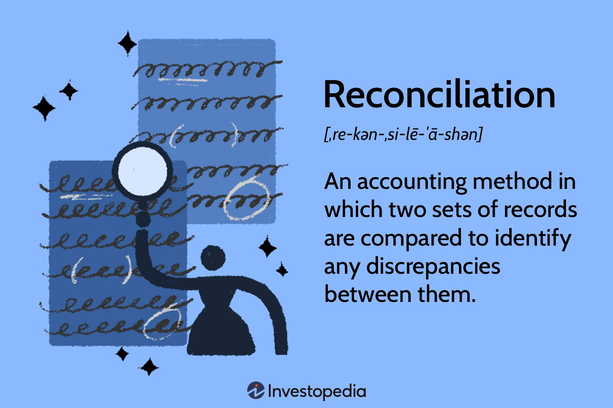
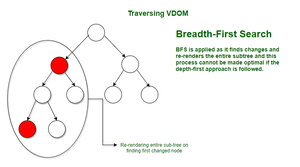
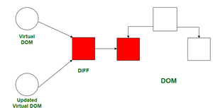

<center>


# ReactJS Session ,Google Developers Student Club -  IIIT-Bhubaneswar
React Session Demo with Documention &amp; Materials.
</center>

# Pre-requisite:
- Should know/have worked with HTML,CSS,JS
- Git, Github (not mandatory,but definitely a ++)
- Basics of Node.js 

---------------------------------------------------------------------------------------------------------
# What is React ? 

React is often perceived simply as a *frontend library* for building user interfaces, but its true nature goes beyond that. React is a sophisticated ecosystem comprised of various tools and technologies working together to help devs in creating fast and performant web applications.

 These include `Babel` for transpiling modern JavaScript syntax, `Node.js` for server-side JavaScript execution,` NPM` for package management, `Webpack/SWC/Vite/Parcel` for bundling assets, and JSX for composing UI components. Together, these tools form the backbone of React development, enabling developers to leverage the full potential of modern web development practices and deliver exceptional user experiences.

 Some Online resources which I loved while learning React : 

 - <a href="https://youtu.be/8pDqJVdNa44?si=wZzce1tj5-WfIXiF">How A Small Team of Developers Created React at Facebook</a>

 

 - <a href="https://www.youtube.com/watch?v=i793Qm6kv3U">Understanding React's UI Rendering Process</a>

 


- <a href="https://www.youtube.com/watch?v=i793Qm6kv3U">Understanding React's UI Rendering Process</a>


---------------------------------------


# Javascript XML / JSX :



Simply , it allows you to put your Javascript code in your HTML and also HTML code in Javascript.

eg: 

# In HTML..

```html
<h1>
    This is your reminder to give your girl some flowers in valentine's day    
</h1>
```

# In JSX (Javascript-XML)
```jsx
import React from 'react';

// A Javascript Function !!
function MyComponent() {
  return (
    // You are returning HTML !! 
    <div>
      <h1>This is also a reminder to give your girl some flowers in valentine's day</h1>
      <p>But,from React.js!</p>
    </div>
  );
};

export default MyComponent;
```

This JSX then compiles down to Plain Javascript , utilizing the methods of the `React` Class,something like : 

```js
import React from 'react';

// A Javascript Function !!
function MyComponent() {
  return React.createElement("div", null,React.createElement("h1", null, "This is also a reminder to give your girl some flowers in valentine's day"),React.createElement("p", null, "But,from React.js!")
  );
};
```

This transformed code is what React understands and renders onto the DOM.


# Let's Talk about Babel.



When you are learning Javascript , There are TONS of new features coming out daily in the JS Ecosystem.

> Don't Trust me ? 
<a href="https://dayssincelastjavascriptframework.com/">Here's a link that tells you about days since the last JS Framework came out.</a>

You need to keep in mind that there are some browsers how don't understand this Javascript and the browser might not support these.

That's where `Babel` helps.

 Babel is like a translator (technically a TRANSPILER or TRANSCOMPILER) for your JavaScript code. It takes your modern JavaScript code and transforms it into an older version that all browsers can understand. This process is called `transpiling`.

- JSX, which is a syntax extension for JavaScript often used with React, Babel can handle that too. JSX looks a lot like HTML mixed with JavaScript, and Babel can convert it into plain JavaScript that browsers can digest.

# Presets
- Think of presets as pre-packaged sets of rules for Babel. Instead of configuring every little detail yourself, you can use presets to quickly set up Babel for specific tasks.

> eg: React developers often use a preset called `@babel/preset-react`, which includes all the necessary rules for converting JSX into JavaScript.

Babel helps you write modern code without worrying about browser compatibility issues. And with features like transpiling and support for JSX, Babel makes the JavaScript learning enjoyable.

# Module Bundlers (SWC/Vite/Webpack/Parcel)


- A large JavaScript project has lots of files and dependencies. It can be quite a mess to manage all these files, especially when it comes to optimizing them for performance and efficiency. 

- Module bundlers, such as `Webpack`, `Parcel`, `Vite`, and `SWC (Speedy Web Compiler)` traverse through your entire source code tree, gathering up all your JavaScript files, CSS files, ./assets/images, and other assets, and then bundle them together into a smaller number of files. This bundling process helps reduce the number of requests your web page makes to the server, which can significantly improve loading times and performance.

##  Some Other Features of Module Bundlers Are:

- Code Splitting: They can split your code into smaller chunks, which are loaded only when needed. This helps reduce initial load times and improves the overall performance of your web application.

- Asset Optimization: They can optimize your assets, such as ./assets/images and fonts, by compressing them or converting them to more efficient formats, further improving load times.

- Development Server: They often come with built-in development servers that allow you to test your code locally and see changes in real-time without having to reload the entire page manually.

- Hot Module Replacement (HMR): They support HMR, which allows you to update your code in real-time without refreshing the browser. This speeds up the development process and makes debugging easier.

- Configuration: They provide flexible configuration options, allowing you to customize the bundling process to suit your project's specific needs.

# What is NodeJS ? 



Node.js is an Open Source (❤️), cross-platform JavaScript runtime environment that executes JavaScript code outside of a web browser.

-    Node.js was created by Ryan Dahl in 2009. He initially built Node.js to address the limitations of traditional server-side technologies, such as Apache HTTP Server, for building scalable, real-time web applications.
- One of the key motivations behind Node.js was to enable developers to use JavaScript for server-side programming, leveraging their existing skills and the popularity of JavaScript in web development.

- Node.js is built on top of the V8 JavaScript engine, developed by Google for the Chrome web browser. The V8 engine compiles JavaScript code into native machine code, optimizing its performance.

# StoryTime!

<a href="#NPM">Skip to NPM</a>

<a href= "https://www.youtube.com/watch?v=M3BM9TB-8yA">Must Watch: 10 Things I Regret about NodeJS - Ryan Dahl</a>

Node.js faced skepticism and slow adoption in its early days. 


> Ryan Dahl,Inventor of NodeJS,Deno,...

In the early 2010s, Ryan Dahl released Node.js to the world, promising a approach to server-side development with JavaScript. However, the developer community was initially hesitant to embrace this new technology. JavaScript, traditionally confined to the browser, seemed out of place in the server-side landscape dominated by languages like Java, Ruby, and Python.

Critics raised concerns about the _immaturity_ of Node.js, questioning its:
- reliability
- scalability  
- suitability 

for production-grade applications. JavaScript developers, accustomed to working on the client side, were skeptical about transitioning to server-side programming, which required a different mindset and skill set.

Moreover, Node.js faced technical challenges, such as handling asynchronous programming and integrating with existing systems and libraries. The lack of comprehensive documentation and best practices further hindered adoption, leaving many developers feeling stranded in bad community.

Despite these issues, a small group of passionate enthusiasts saw the potential of Node.js and persevered. They experimented with Node.js, pushing its boundaries, and sharing their findings with the community. As Node.js gained traction, a vibrant ecosystem began to emerge, with the release of new modules, frameworks, and tools to support Node.js development.

Over time, Node.js started to win over skeptics with its performance, scalability, and simplicity. Its event-driven, non-blocking architecture proved ideal for building real-time applications, APIs, and microservices. Companies like Netflix, LinkedIn, and Uber adopted Node.js for their backend systems, showcasing its ability to handle large-scale, high-traffic applications.

Today, Node.js stands as a testament to the power of perseverance and innovation. Its journey from a niche technology to a mainstream platform reflects the resilience of the developer community and the transformative impact of open-source collaboration. Node.js continues to evolve, driving forward the future of web development and inspiring the next generation of developers to push the boundaries of what's possible.
    
# NPM 


NPM is the default package manager for Node.js and the JavaScript ecosystem. It allows developers to discover, install, and manage dependencies for their projects. 

- Dependency Management: NPM maintains a registry of packages, containing reusable code and libraries for various purposes. Developers can use the npm install command to install dependencies listed in their `package.json` file.

- Versioning: NPM supports semantic versioning (`semver`), enabling developers to specify the version ranges of dependencies in their package.json file. This ensures compatibility and helps prevent breaking changes.

- Scripts: NPM allows developers to define custom scripts in their package.json file, which can be executed using the npm run command. This is useful for automating tasks such as building, testing, and running the application.

> HINT: The package.json file is a metadata file for Node.js projects, containing various configurations and dependencies.

## A Key Note on `package.json` scripts ...

### `npm run dev` :

When you run `npm run dev` with `Vite`, it starts a development server that serves your project locally.The development server compiles your project's source code on-the-fly and keeps the compiled files in your Computer's `RAM`.


This means that changes you make to your code are immediately reflected in the browser without needing to manually rebuild or refresh the page.
   
### `npm run build` :

When you run npm run build with Vite, it performs a production build of your project.

During the build process, Vite compiles your project's source code and generates optimized, minified, and bundled files suitable for deployment.The output of the build process is written to the disk as static files in a dist or build directory.
These static files are ready to be served by a web server and are optimized for performance and production use.
    

## How does React work then ?




>  React works with synchronous use of the above mentioned tools 

React constructs an in-memory representation of the Document Object Model (DOM), known as the Virtual DOM. 

- Upon any `state` or `data` change within a React app, instead of _directly_ manipulating the browser's DOM, React generates a new virtual representation of the desired UI state.

- Subsequently, React employs a `reconciliation` process, utilizing a sophisticated `Diffing algorithm` to analyze the discrepancies between the new and previous Virtual DOM states.

- By discerning these differences, React efficiently updates only the affected portions of the actual DOM, thereby minimizing unnecessary re-rendering and enhancing performance

## But why not directly manipulate the browser DOM ?

> React utilizes the Virtual DOM to optimize the process of updating the browser's DOM. Directly manipulating the browser's DOM can be inefficient and resource-intensive, especially when dealing with complex UIs and frequent updates. Every time a change occurs, directly modifying the DOM would require recalculating styles, reflowing layout, and triggering repaints, which can lead to performance bottlenecks and degraded user experience, particularly on large-scale applications.



By employing the Virtual DOM, React minimizes these performance concerns. Instead of immediately updating the actual DOM upon every state or data change, React first computes the minimal set of changes needed to bring the Virtual DOM in sync with the desired UI state. This process is HIGHLY efficient because it involves manipulating lightweight, in-memory representations rather than the actual browser DOM. Once the necessary changes are identified, React performs a targeted update to the real DOM, selectively applying the changes without unnecessary reflows or repaints.



## A Benchmark (Sample) on RAM and Time taken by Directly Modifying Browser DOM v/s React Virtual DOM Approach

| Method                      | Time Taken (ms) | RAM Usage (MB) | Number of Files | Project Size (MB) |
|-----------------------------|------------------|----------------|-----------------|-------------------|
| React Virtual DOM Method    | 10               | 50             | 100             | 5                 |
| Direct DOM Manipulation     | 500              | 500            | 10              | 10                |

---------------------------

---
Thank you for reading!
Do give the Repo a 🌟 if you liked it.

Author: <a href="https://github.com/zakhaev26/">Soubhik Gon</a>
